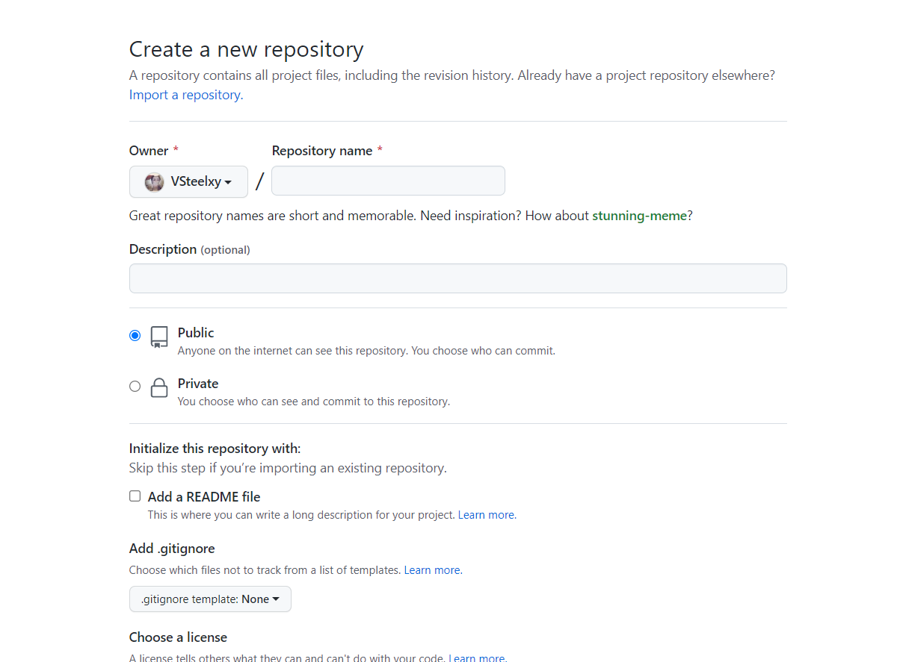
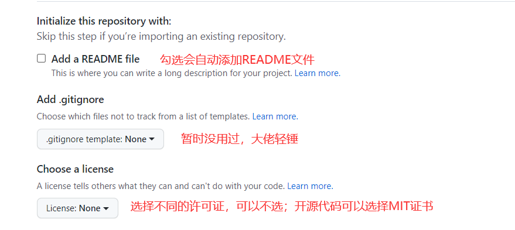
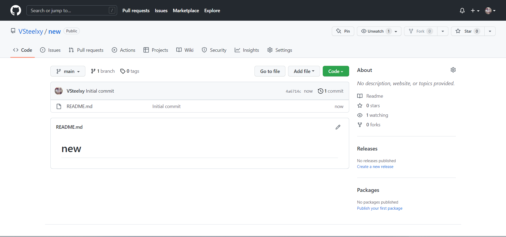
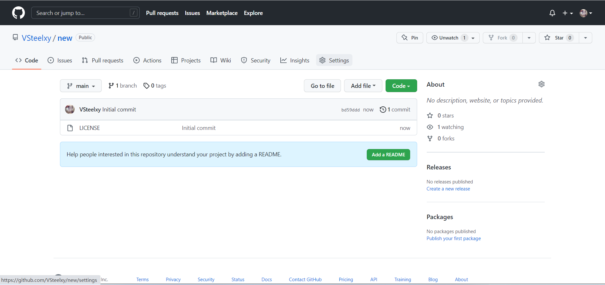
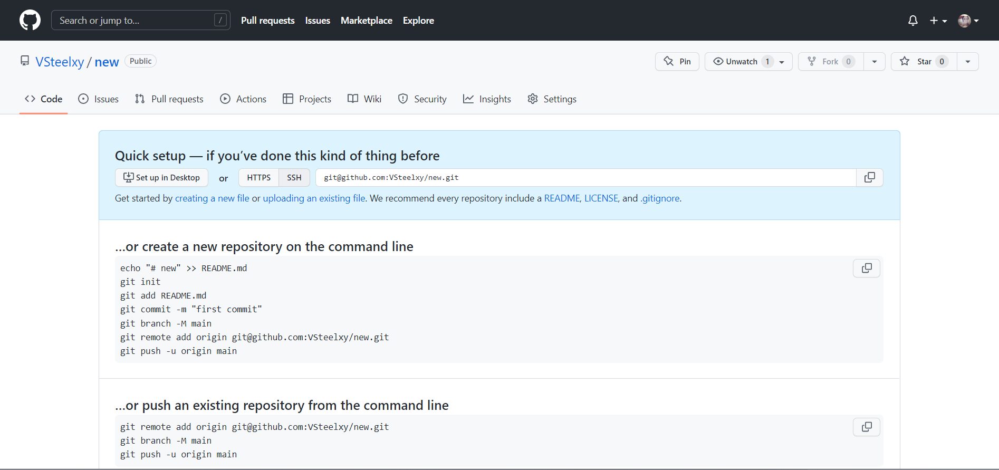

# git连接远程Github仓库
- 准备工作：安装了git；注册了Github账号
## 首先在Github创建一个空白仓库 
- 登录账号，主页左侧或者右侧会有一个绿色的NEW按钮，点击就进入创建仓库的界面

- 创建仓库的名字；下面的仓库描述是可选的
- 选择仓库是否公开，私有的仓库需要钱
- 创建的时候有三种不同的初始选项：添加READEME文件，添加.gitignore,添加证书，勾选不同的初始项创建的仓库有点不同 

- 选择添加README文件，初始化后的仓库包括一个README.md文件
> REAMDE.md文件是一个解释介绍文件；Github是代码托管平台，READE.md文件就是说明文档；也就是说最简单的Github个人网站就是用一堆md文件  

> REMADE.md文件后面可以通过git来添加；如果此处勾选了，后面git就不能添加了

- 选择添加MIT，初始化后的仓库包括一个MIT文件

- 选择.gitignore文件；应该是一样的，多一个文件；我就没有测了，感兴趣的可以自己尝试
- 什么都不选择，创建出来的仓库什么都没有，平台会有提示连接git来填充仓库

- 总结：不管选择什么初始化选项，仓库创建成功都是一样的；这样远程仓库就创建成功了
