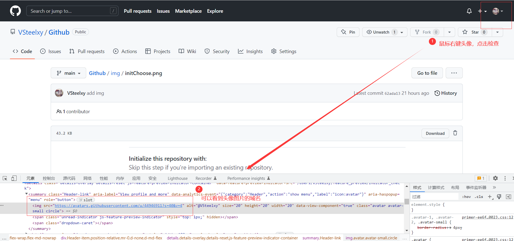

# Github项目中图片无法显示问题
```
- 养成习惯：git操作之前先将远程仓库拉取到本地，一定要保持本地版本不能低于远程
- 因为我没有下载markdown，所以编写md文件习惯在GitHub编写可以边编写边看效果，导致远程仓库的版本一直高于本地
```
> 个人理解
- 背景：我在本仓库新建了一个图片池（img文件夹），仓库中用到的图片从仓库引用即可。
- 问题：仓库项目中图片池中的所有图片都无法显示
- 原因：个人觉得是域名解析错误，不排除其他原因
- 分析：GitHub在美国，我们请求的时候需要将域名解析成ip；域名解析的时候会先查找本地的hosts文件看是否有这个域名对应的ip
- 解决：在本地hosts中添加ip映射的域名
    - 问题：GitHub中不同类型的图片保存在不同的域名下；具体什么域名可以通过鼠标右键显示失败的图片选择检查；在开发者工具中的控制台console查看；
    - 域名：我是项目中的图片查看到的是```raw.githubusercontent.com```
    - 头像中的图片的域名查看如下  
    - 问题：域名对应的ip是什么；可以在查询域名对应ip关系网站上查询https://www.ipaddress.com
- 具体解决方案，我是参考CSDN中大佬的博客https://blog.csdn.net/zhanghan18333611647/article/details/113706315

> 省流做法
- 第零步：hosts文件路径是```C:\Windows\System32\drivers\etc\hosts```要管理员权限才可以修改；
- 第一步：home+Q打开搜索界面；搜索cmd用管理员身份打开cmd
- 第二步：用记事本打开hosts文件；cmd中输入指令```notepad C:\Windows\System32\drivers\etc\hosts```
- 第三步：在hosts文件最后把ip和域名对应关系添加即可（hosts文件最后添加下面代码）；记得保存
```
185.199.111.133 raw.githubusercontent.com
185.199.108.133 raw.githubusercontent.com
185.199.109.133 raw.githubusercontent.com
185.199.110.133 raw.githubusercontent.com
```
- 第四步：需要刷新dns；在cmd中输入命令```ipconfig/flushdns```

> 总结

走完上面四步，我的图片池运行正常。仅供参考，欢迎交流。

